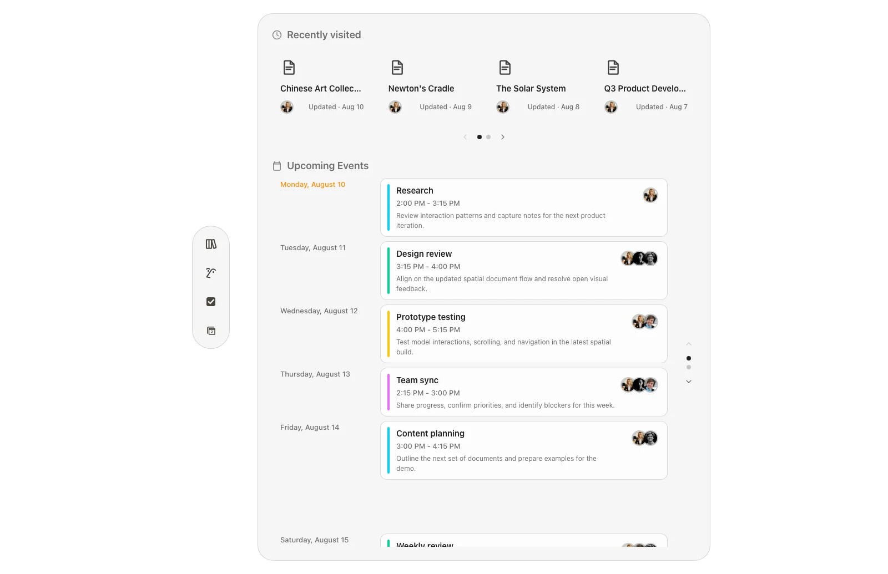

<p align="center">
  
</p>

<h1 align="center">WebSpatial Notion</h1>

<p align="center">
  A Notion-inspired productivity demo for ordinary browsers and WebSpatial runtimes.
</p>

<p align="center">
  <a href="https://mock-notion.vercel.app"></a>
  <a href="LICENSE"></a>
  <a href="https://react.dev"></a>
  <a href="https://www.npmjs.com/package/@webspatial/react-sdk"></a>
</p>

<p align="center">
  <strong>Open-source demo and reference app.</strong><br>
  <a href="https://mock-notion.vercel.app">Open the live demo →</a>
</p>



## Features

- **Notion-inspired dashboard** — browse recently visited documents and a paginated upcoming-events schedule.
- **Document workspace** — open route-addressable documents through a sidebar that preserves browser history.
- **Spatial 3D documents** — inspect a complete Solar System, an animated Newton's Cradle, and an interactive Chinese Art Collection.
- **Model annotations** — open model-attached descriptions inside WebSpatial `Reality` scenes.
- **Direct model interaction** — rotate and resize supported models, with bounded repositioning for the Chinese Art Collection.
- **Notion AI concept** — explore a chat layout with recent conversations and a compact prompt composer.
- **Todo and calendar views** — switch between focused productivity surfaces from the shared navigation rail.
- **Browser fallback** — use the same routes in an ordinary browser with a light Notion-style theme and browser-safe model assets.
- **Installable shell** — use the included web app manifest and icons as a standalone PWA-style demo.

## How It Works

```text
Browser or WebSpatial runtime
└── src/main.tsx
    ├── Detect runtime and apply html.is-web or html.isSpatial
    ├── Load the browser model polyfill only when needed
    └── Render one shared React route tree
        ├── /                         Dashboard
        ├── /doc/:slug               Document workspace and 3D documents
        ├── /ai                      Notion AI concept
        ├── /todo                    Todo list
        └── /calendar                Calendar
```

The application has no backend. Documents, tasks, conversations, calendar events, and model metadata live in the client bundle or component state. Direct route loads work on Vercel through the rewrites in `vercel.json`.

Spatial and browser modes share the same React routes. WebSpatial adds spatial materials, depth, `Reality` scenes, native model entities, and attachments. Ordinary browsers use the same document layouts with browser-safe USDZ variants and a conditionally loaded model-element polyfill.

## Tech Stack

- [React 19](https://react.dev) and TypeScript 6
- [Vite 8](https://vite.dev)
- [Tailwind CSS 4](https://tailwindcss.com)
- [WebSpatial 1.7](https://www.npmjs.com/package/@webspatial/react-sdk)
- [Lucide](https://lucide.dev)
- ESLint 10

## Prerequisites

- Node.js 22.12 or newer
- npm 11 or another package manager compatible with the existing lockfile
- Google Chrome or Chromium only when rebuilding the README screenshot
- Xcode with a supported visionOS simulator when using WebSpatial Builder for Apple Vision Pro

## Local Setup

```bash
git clone https://github.com/georgebutler/webspatial-notion.git
cd webspatial-notion
npm install
npm run dev
```

Open the URL printed by Vite, usually [http://localhost:5173](http://localhost:5173).

The repository also contains `pnpm-lock.yaml`, but the documented workflow uses npm and `package-lock.json`. Do not regenerate either lockfile unless a dependency change requires it.

## Routes

| Route | View |
| --- | --- |
| `/` | Dashboard |
| `/doc` | Redirects to the Solar System document |
| `/doc/the-solar-system` | Solar System overview and planet details |
| `/doc/newtons-cradle` | Newton's Cradle notes and animated model |
| `/doc/chinese-art-collection` | Interactive vase, painting, and tea-set collection |
| `/ai` | Notion AI concept |
| `/todo` | Todo list |
| `/calendar` | Calendar |

## Scripts

| Command | Purpose |
| --- | --- |
| `npm run dev` | Start the Vite development server on an externally reachable host. |
| `npm run build` | Run TypeScript project references and create the production build. |
| `npm run lint` | Run ESLint across the repository. |
| `npm run preview` | Build and serve the production output on port `5173`. |
| `npm run avp` | Build, then launch WebSpatial Builder against `http://localhost:5173`. |
| `npm run screenshots:readme` | Build and recapture the `1600×1035` Dashboard screenshot through headless Chrome. |

Set `CHROME_PATH` if the screenshot script cannot find Chrome in a standard macOS or Linux location.

## WebSpatial Preview

Start the production preview in one terminal:

```bash
npm run preview
```

Run WebSpatial Builder in another:

```bash
npm run avp
```

The `avp` command targets Apple Vision Pro through `@webspatial/platform-visionos`. The source also keeps the browser/spatial runtime split compatible with WebSpatial hosts such as PICO OS, but device packaging and deployment depend on the target platform's WebSpatial tooling.

## Model Behavior

- `src/Model3D.tsx` wraps the SDK `Model` component and always enables XR.
- Solar System overview and planet-detail scenes use `Reality`, `ModelAsset`, `ModelEntity`, and model-attached annotations.
- Newton's Cradle uses separate spatial and browser USDZ packages and plays its authored loop.
- The Chinese Art Collection uses separate spatial and PNG-textured browser packages. Spatial mode supports rotation, bounded repositioning, and independent description attachments. Browser mode layers the same three objects into one orbitable collection stage with always-visible information cards below it.
- `src/main.tsx` loads `public/model-element-polyfill.js` only in ordinary browsers without native `HTMLModelElement` support. Native spatial runtimes must not load that polyfill.

Everything under `public/` is served as a public static asset.

## Deploy to Vercel

1. Import this repository into [Vercel](https://vercel.com/new/clone?repository-url=https%3A%2F%2Fgithub.com%2Fgeorgebutler%2Fwebspatial-notion).
2. Deploy with the default Vite settings.
3. Keep `vercel.json` so direct loads of document and tool routes resolve to `index.html`.

The project has no environment variables or server-side services.

## Data and Privacy

- The demo has no authentication, account system, analytics integration, database, or application backend.
- Content is static or held in memory and resets when the page reloads.
- Model and image assets are downloaded from the same deployment origin.
- Opening document or tool windows uses `noopener,noreferrer` to prevent opener access.

## Project Status

WebSpatial Notion is an actively developed frontend demo and reference implementation. It explores how a familiar productivity interface can carry into spatial computing without maintaining separate browser and XR applications.

It is not affiliated with Notion Labs, Inc. and is not a production Notion client. It does not provide document editing, sync, collaboration, comments, permissions, or data import.

## Contributing

Issues and focused pull requests are welcome. Before submitting a change, run:

```bash
npm run build
npm run lint
git diff --check
```

Update the README screenshot with `npm run screenshots:readme` when a visible Dashboard, navigation, or shared browser-theme change affects the captured view.

## Acknowledgements

- [WebSpatial](https://webspatial.dev) provides the spatial web runtime, React bindings, and builder tooling.
- The browser model fallback uses the Immersive Web model-element polyfill vendored in `public/model-element-polyfill.js`.
- Notion is a trademark of Notion Labs, Inc. This project is an independent interface study and does not imply affiliation or endorsement.
- Third-party model assets, images, trademarks, and packages remain subject to their respective licenses and terms.

## License

The repository's original code and documentation are available under the [MIT License](LICENSE). Third-party assets, models, packages, names, logos, and services retain their own licenses and terms.
